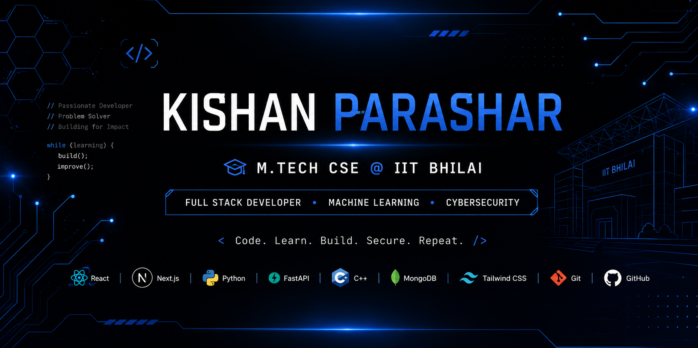

# Hi 👋 I'm Kishan Parashar

### M.Tech CSE @ IIT Bhilai

## 👨‍💻 About Me

🎓 M.Tech CSE Student at **IIT Bhilai**

💻 Passionate about **Full Stack Development**

🤖 Exploring **Machine Learning**

🔐 Learning **Cybersecurity**

🚀 Building practical applications that solve real-world problems.

📚 Currently learning **System Design** and advanced backend development.

## 📊 GitHub Stats

  
  

## 🔥 GitHub Streak

  

## 🛠️ Tech Stack

## 🌐 Connect With Me

## 🚀 Featured Projects

| Project | Description |
|---------|-------------|
| 📰 **AI-Powered Fake News Detection** | Full Stack ML application using Next.js, FastAPI, Scikit-learn & Tailwind CSS |
| 🔍 **Smart Lost Object Finder** | Object Detection using Grounding DINO |
| ☕ **Get Me A Chai** | Patreon-inspired crowdfunding platform |
| 🌐 **Portfolio Website** | Personal portfolio showcasing projects and skills |